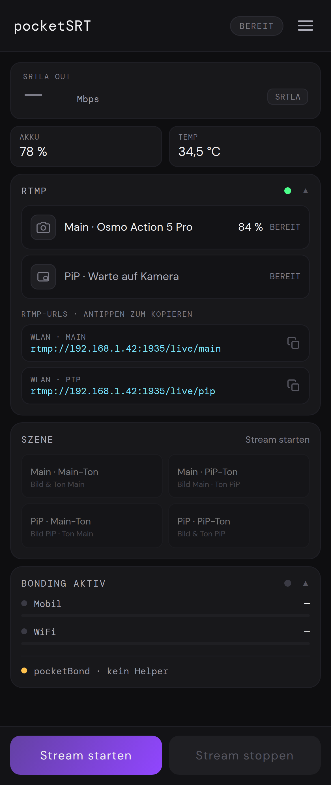
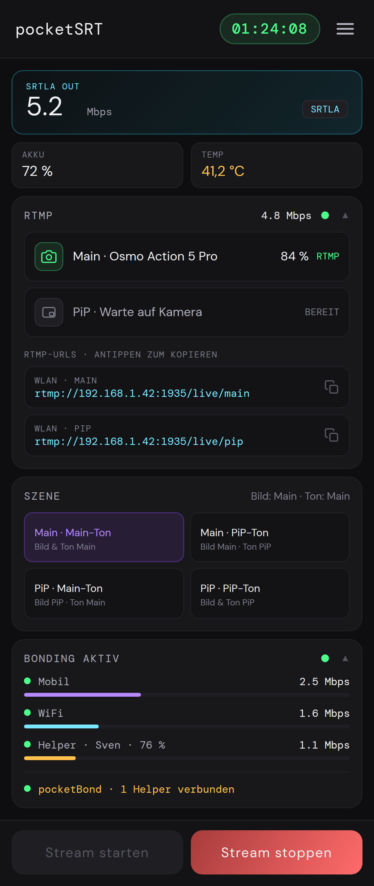

# pocketSRT

**Mobile RTMP-zu-SRT/SRTLA-Bridge für Android – mit SRTLA-Bonding, adaptiver Bitrate, DJI-Auto-Connect und synchronisiertem Picture-in-Picture.**

pocketSRT empfängt RTMP-Streams von Kameras oder Streaming-Software und sendet das Programm als SRT oder SRTLA weiter. Der RTMP-Ingest läuft nativ auf dem Android-Gerät; Node.js, FFmpeg und externe Streaming-Hardware werden nicht benötigt.

## Download

[Neueste Version als APK herunterladen](https://github.com/romestylez/pocketSRT/releases/latest)

> Die README beschreibt den aktuellen Stand von **pocketSRT 5.0.0**. Unter „Neueste Version“ liegt immer die zuletzt veröffentlichte APK; bis zum nächsten Release kann diese noch eine ältere Versionsnummer tragen.

Erfordert Android 8.0 oder neuer und ein 64-Bit-ARM-Gerät (`arm64-v8a`). Die DJI-Integration erkennt Osmo Action 2, 3, 4, 5 Pro und 6, Osmo 360 sowie Osmo Pocket 3.

## Funktionen

- Nativer RTMP-Server für Actionkameras, Camcorder, OBS und andere RTMP-Quellen
- SRT- und SRTLA-Ausgang mit adaptiver Bitratensteuerung
- SRTLA-Bonding über Mobilfunk, WLAN, Ethernet und zusätzliche [pocketBond](https://github.com/romestylez/pocketBond/)-Handys
- DJI-Auto-Connect per Bluetooth LE für unterstützte DJI-Kameras
- Synchronisiertes Picture-in-Picture mit einer zweiten RTMP-Quelle
- Wechsel von Main und PiP im laufenden Stream, einschließlich Programmton
- Vier frei wählbare Bild-/Ton-Szenen: Main/Main-Ton, Main/PiP-Ton, PiP/Main-Ton und PiP/PiP-Ton
- Einstellbare PiP-Synchronisierung, Position, Größe und 16:9-/9:16-Layout
- Optionale Steuerung unterstützter Black-Shark-Smartphone-Kühler
- Lokale REST API für Status, Steuerung und Telemetrie
- Live-Status, Bitratenanzeige und exportierbare Diagnose-Logs

## Screenshots

<p align="center">
  
  
</p>

## Signalweg

```text
Kamera / OBS ──RTMP──> nativer RTMP-Ingest ──> Media3 / MediaCodec
                                              │
                                              └──> MPEG-TS ──SRT/SRTLA──> Streaming-Ziel
```

Für PiP kommt eine zweite RTMP-Quelle hinzu:

```text
Main: rtmp://<handy-ip>:1935/live/stream ─┐
                                         ├──> synchronisiertes Programm ──> SRT/SRTLA
PiP:  rtmp://<handy-ip>:1935/live/pip ────┘
```

## Schnellstart

### 1. Ausgang einrichten

Im Bereich **Output**:

1. `SRT` oder `SRTLA` auswählen.
2. Ziel-URL eintragen, zum Beispiel:

   ```text
   srt://dein-server.com:5000?streamid=dein-key
   srtla://dein-server.com:5000?streamid=dein-key
   ```

3. Optional eine maximale Bitrate in kbit/s festlegen.

### 2. Hauptquelle verbinden

Die App zeigt die passende RTMP-Adresse für das aktuelle Netzwerk an. Diese Adresse als Streaming-Ziel in der Kamera oder Software eintragen und den RTMP-Stream starten.

Für DJI-Kameras kann unter **Menü → DJI Settings** WLAN, RTMP-Ziel und Auto-Start eingerichtet werden. pocketSRT konfiguriert und startet die Kamera anschließend per Bluetooth LE.

### 3. Stream starten

Sobald die Hauptquelle sendet, **Stream starten** antippen. Verbindungsstatus, aktive Bonding-Pfade und Ausgangsbitrate werden auf der Startseite angezeigt.

## Picture-in-Picture

PiP gehört in Version 5.0.0 zum Media3-/ExoPlayer-Ingest:

1. Unter **Menü → PiP** die Option **PiP aktivieren** einschalten.
2. Die zweite Quelle an die dort angezeigte PiP-Adresse (`/live/pip`) senden lassen.
3. Den Stream neu starten, damit die geänderte PiP-Konfiguration aktiv wird.

Main und PiP können während des Streams unabhängig als Bild- und Tonquelle gewählt werden. Die vier Szenen **Main · Main-Ton**, **Main · PiP-Ton**, **PiP · Main-Ton** und **PiP · PiP-Ton** schalten Bild und Programmton gemeinsam auf derselben Zeitachse. Die PiP-Einstellungen erlauben außerdem einen manuellen Synchronisationsversatz, weiche Rollenwechsel sowie Änderungen an Position, Größe, Drehung, Rahmen und Seitenverhältnis.

Für einen stabilen PiP-Betrieb werden H.264/SDR, 720p und 25 oder 30 fps für die zweite Quelle empfohlen.

## BlackShark-Kühler

pocketSRT kann unterstützte Black-Shark-MagCooler per Bluetooth LE steuern. Die Einrichtung befindet sich unter **Menü → BlackShark**.

- **MagCooler 4 Pro:** Kühlleistung und Lüftersteuerung
- **MagCooler 5 Pro:** fünf Intensitätsstufen und LED-Steuerung
- **MagCooler 6:** Normal-/Silent-Modus und LED-Steuerung
- Automatisches Ein- und Ausschalten anhand frei wählbarer Start- und Stopptemperatur
- Anzeige der aktuellen Gerätetemperatur sowie des Verbindungs- und Automatikstatus
- Manuelles Ein- und Ausschalten, wenn die Temperaturautomatik deaktiviert ist

Die getrennten Start- und Stopptemperaturen bilden eine Hysterese und verhindern dadurch ständiges Ein- und Ausschalten nahe der Grenztemperatur. Die MagCooler-5-Pro-Protokollunterstützung ist implementiert, benötigt in pocketSRT aber noch die abschließende Prüfung mit echter Hardware.

## SRTLA und pocketBond

SRTLA verteilt den Stream über mehrere Netzwerkpfade. pocketSRT kann auf einem Gerät Mobilfunk, WLAN und Ethernet als getrennte Pfade verwenden.

Zusätzliche Android-Handys lassen sich mit [pocketBond](https://github.com/romestylez/pocketBond/) als weitere Mobilfunkpfade einbinden:

1. pocketBond auf den Hilfs-Handys installieren.
2. In pocketSRT und pocketBond dasselbe Passwort eintragen.
3. Alle Geräte mit demselben lokalen WLAN verbinden.
4. Auf jedem Hilfs-Handy einen aktiven Mobilfunk-Datentarif bereitstellen.

Wenn die Kamera ein WLAN ohne Internet bereitstellt, kann je nach Android-Gerät die Entwickleroption **Mobile Daten immer aktiv** oder ein zusätzlicher Ethernet-Uplink erforderlich sein.

## Monitoring und Logs

Die Startseite zeigt den Status des RTMP-Eingangs, des SRT/SRTLA-Ausgangs und der einzelnen Bonding-Pfade sowie deren aktuelle Datenrate. Unter **Menü → Log** stehen ausführliche Diagnoseinformationen und der Log-Export zur Verfügung.

## Credits

| Projekt | Verwendung in pocketSRT | Lizenz |
|---|---|---|
| [srtdroid](https://github.com/ThibaultBee/srtdroid) | SRT-Protokoll und SRT-Ausgang | Apache-2.0 |
| [AndroidX Media3](https://github.com/androidx/media) | ExoPlayer-basierter FLV/RTMP-Ingest, Decoder und Wiedergabezeitachse | Apache-2.0 |
| [Moblin](https://github.com/eerimoq/moblin) | Referenz und übertragene Logik für DJI BLE, SRTLA, adaptive Bitrate und nativen RTMP-Ingest | MIT |
| [HaishinKit](https://github.com/HaishinKit/HaishinKit.swift) | Referenz für Teile der nativen RTMP-Protokollimplementierung | BSD-3-Clause |
| [BlackSharkLib.swift](https://github.com/Spillmaker/BlackSharkLib.swift) | Referenz für das BLE-Protokoll unterstützter Black-Shark-Kühler | MIT |

Weitere Abhängigkeiten und Lizenzhinweise stehen in [THIRD_PARTY_LICENSES.md](THIRD_PARTY_LICENSES.md).

## Support

- [Ko-fi](https://ko-fi.com/romestylez)
- [GitHub Sponsors](https://github.com/sponsors/romestylez)
